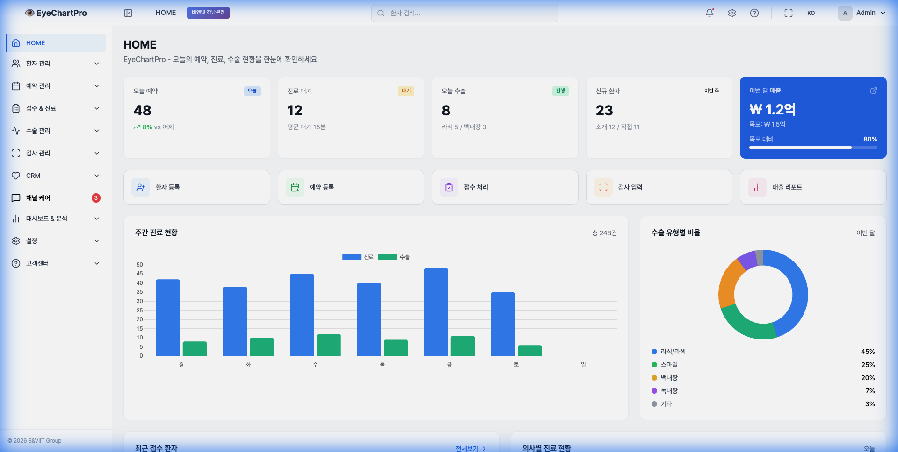

# 안과 병원 경영 효율화 대시보드 사용자 가이드

이 문서는 병원 운영진과 의료진이 **수술실 운영 효율화 및 재무 성과 대시보드**를 효과적으로 활용하기 위한 사용자 매뉴얼입니다. 실제 구현된 대시보드 화면을 예시로 설명합니다.

## 1. 대시보드 개요 (Dashboard Overview)

대시보드는 병원의 핵심 성과 지표(KPI)를 실시간으로 시각화하여, 경영 효율성을 높이고 즉각적인 의사결정을 지원합니다.

*▲ [그림 1] 대시보드 메인 화면*

### 주요 영역 구성

1. **사이드바 (Sidebar)**: 주요 메뉴로 이동 (환자 관리, 수술 스케줄, 재무 리포트 등).
2. **KPI 요약 카드 (Top Cards)**: 금일 예약, 대기 환자, 수술 건수 등 핵심 지표 스냅샷.
3. **상세 차트 (Charts)**: 주간 진료 현황, 수술 유형별 비율 등 트렌드 분석.

---

## 2. 주요 기능 및 메뉴 (Key Features)

### 2.1 네비게이션 메뉴 (Navigation)

좌측 사이드바를 통해 병원 관리의 모든 기능에 접근할 수 있습니다.

*▲ [그림 2] 네비게이션 메뉴*

* **Dashboard**: 현재 보고 계신 메인 요약 화면입니다.
* **Patients**: 환자 정보를 조회하고 관리합니다.
* **Schedule**: 수술 및 진료 일정을 캘린더 형태로 확인합니다.
* **Settings**: 병원 기본 정보 및 사용자 권한을 설정합니다.

### 2.2 핵심 성과 지표 (KPI Cards)

경영진과 수술실 관리자가 가장 먼저 확인해야 할 핵심 숫자들을 상단 카드 형태로 제공합니다.

*▲ [그림 3] 월간 매출 목표 달성 현황 카드*

* **진행률 표시**: 목표 대비 현재 달성률을 퍼센트(%)와 프로그레스 바(Progress Bar)로 직관적으로 표시합니다.
* **트렌드 (Trend)**: 전월 또는 전주 대비 상승/하락 폭을 표시하여 성과 추이를 즉시 파악할 수 있습니다 (예: `+12.5%`).

---

## 3. 활용 가이드

### 상황 1: 아침 브리핑 (Daily Huddle)

* **확인할 것**: 메인 화면의 **'Today's Appointments'**와 **'Scheduled Surgeries'**.
* **목적**: 금일 예상되는 병목 구간(환자 몰림 시간대)을 사전 파악하고 인력을 배치합니다.

### 상황 2: 주간 경영 회의 (Weekly Review)

* **확인할 것**: 하단의 **'Weekly Treatment Status'** 그래프.
* **목적**: 요일별 환자 유입 패턴을 분석하여 마케팅 효과를 검증하거나 의료진 근무표를 조정합니다.

---
**Tip**: 모바일에서도 동일한 URL로 접속하여 언제 어디서든 현황을 모니터링할 수 있습니다.
